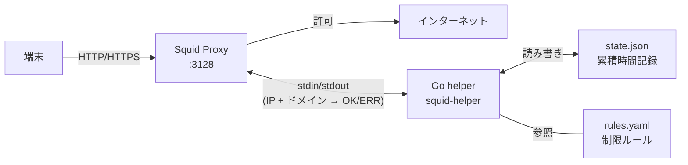
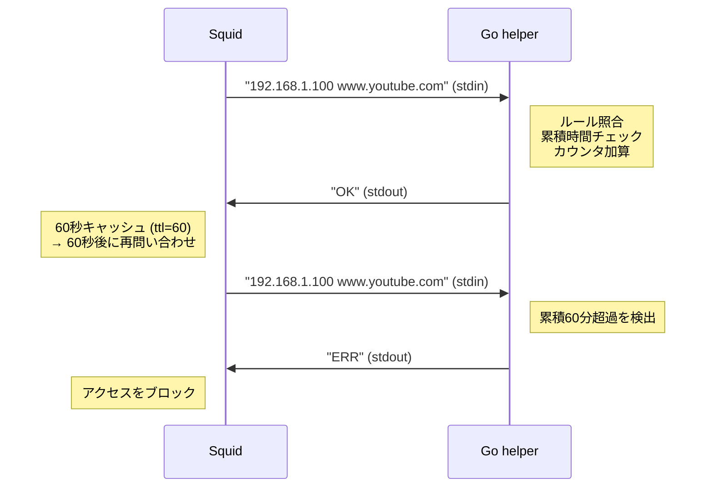

# SquidBrocker

デバイス（IP）× ドメインごとに **1日の累積アクセス時間を制限する** Squid プロキシ。

例: 「子どものタブレットは YouTube を1日60分まで」「TikTok は30分まで」など。

`docker compose up` で即起動。Raspberry Pi での利用を想定。

## 仕組み



1. Squid が全リクエストを Go helper に問い合わせる（60秒間隔）
2. Go helper が `rules.yaml` のルールと累積時間を照合
3. 制限時間内なら `OK`、超過したら `ERR`（ブロック）
4. 日付が変わるとカウントリセット

**ルールに未登録のデバイスは制限なし**（親のPCなどはそのまま通す）。

## アーキテクチャ詳細

### external_acl_type の仕組み

Squid には外部プログラムに認可判定を委譲する `external_acl_type` という仕組みがある。



- Squid は helper を**子プロセスとして常駐起動**する（リクエストごとの起動ではない）
- stdin に1行送り、stdout から1行の応答を待つ、行ベースのプロトコル
- `OK` → アクセス許可、`ERR` → アクセス拒否

### squid.conf の構成

```squid
# ポート 3128 でリクエストを受け付ける
http_port 3128

# external_acl_type の定義
# - time_limiter: この ACL の名前
# - ttl=60: 応答を60秒キャッシュ（=60秒ごとに再問い合わせ）
# - children-max=2: helper プロセスの最大数
# - %SRC: 送信元IPを helper に渡す
# - %DST: 宛先ドメインを helper に渡す
external_acl_type time_limiter ttl=60 children-max=2 %SRC %DST /usr/local/bin/squid-helper ...

# helper の結果を ACL として使う
acl time_check external time_limiter

# helper が ERR を返したらブロック
http_access deny !time_check

# LAN からのアクセスは許可
acl localnet src 192.168.0.0/16
http_access allow localnet

# それ以外は拒否
http_access deny all
```

**`ttl=60` が時間計測の仕組みのキモ。** Squid は OK を受け取ると60秒間キャッシュし、60秒後に再度 helper に問い合わせる。helper は OK を返すたびに `check_interval_seconds`（= 60秒）を累積カウンタに加算する。つまり OK 1回 = 1分消費。

### 制限の精度について

- **ドメイン単位**で制御する（パス単位は不可）
- HTTPS 通信はドメイン名（SNI / CONNECT）のみ見える。URLパスは暗号化されているため見えない
- パス単位の制御には SSL Bump（MITM）が必要だが、証明書管理が複雑になるため本ツールでは対象外

## セットアップ

### 1. サーバー側（Raspberry Pi など）

```bash
# SquidBrocker のIPを確認（例: 192.168.1.10）
hostname -I

# rules.yaml を編集して制限ルールを設定
vi rules.yaml

# 起動
docker compose up -d
```

### 2. 端末側のプロキシ設定

SquidBrocker の IP が `192.168.1.10` の場合、各端末で以下を設定する。

#### iPhone / iPad

1. **設定** → **Wi-Fi** → 接続中のネットワーク横の **(i)** をタップ
2. 下部の **プロキシを構成** をタップ
3. **手動** を選択
4. サーバー: `192.168.1.10` / ポート: `3128`
5. **保存**

#### Android

1. **設定** → **ネットワークとインターネット** → **Wi-Fi**
2. 接続中のネットワークを長押し → **ネットワークを変更**
3. **詳細設定** → **プロキシ** → **手動**
4. ホスト名: `192.168.1.10` / ポート: `3128`
5. **保存**

#### Windows

1. **設定** → **ネットワークとインターネット** → **プロキシ**
2. **手動プロキシセットアップ** をオン
3. アドレス: `192.168.1.10` / ポート: `3128`
4. **保存**

#### macOS

1. **システム設定** → **Wi-Fi** → 接続中のネットワーク → **詳細...**
2. **プロキシ** タブ
3. **Web プロキシ (HTTP)** と **保護された Web プロキシ (HTTPS)** をオン
4. サーバー: `192.168.1.10` / ポート: `3128`
5. **OK** → **適用**

#### Linux

```bash
# 環境変数で設定（シェルごと）
export http_proxy=http://192.168.1.10:3128
export https_proxy=http://192.168.1.10:3128

# または /etc/environment に永続化
echo 'http_proxy=http://192.168.1.10:3128' | sudo tee -a /etc/environment
echo 'https_proxy=http://192.168.1.10:3128' | sudo tee -a /etc/environment
```

### Tips

- **子どもの端末だけ制限したい場合**: 制限したい端末だけプロキシ設定をする。親の端末はプロキシ設定不要
- **端末のIPを固定する**: ルーターの DHCP 設定で MAC アドレスに固定IPを割り当てると、`rules.yaml` の `device` とずれなくなる
- **プロキシ設定を勝手に外されたくない場合**: iOS は「スクリーンタイム」、Android は「Family Link」で設定変更をロックできる

## ルール設定

`testdata/rules_test.yaml` にサンプルがあるので、コピーして編集すると簡単。

```bash
cp testdata/rules_test.yaml rules.yaml
vi rules.yaml   # 端末のIPや制限時間を環境に合わせて編集
```

編集後は `docker compose restart` で反映される。

```yaml
domain_groups:
  - name: youtube
    domains:
      - .youtube.com
      - .googlevideo.com
      - .ytimg.com
  - name: social
    domains:
      - .tiktok.com
      - .instagram.com

rules:
  - device: 192.168.1.100     # 対象端末のIP
    label: kids-tablet
    limits:
      - group: youtube
        daily_minutes: 60      # 1日60分まで
      - group: social
        daily_minutes: 30

check_interval_seconds: 60     # チェック間隔（秒）
```

## 開発

```bash
make test      # テスト実行
make build     # バイナリビルド
make lint      # golangci-lint
make up        # docker compose up
make down      # docker compose down
```
